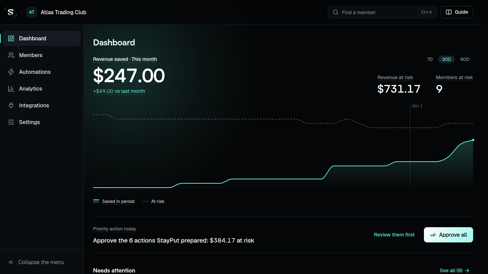
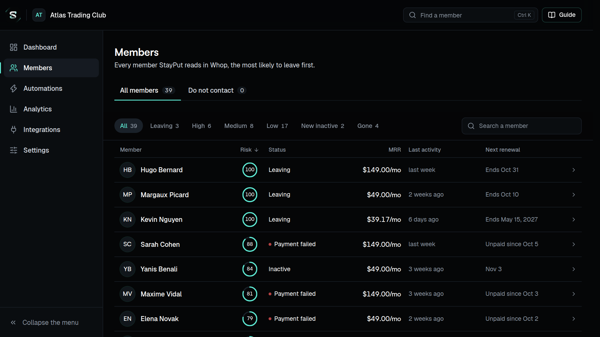
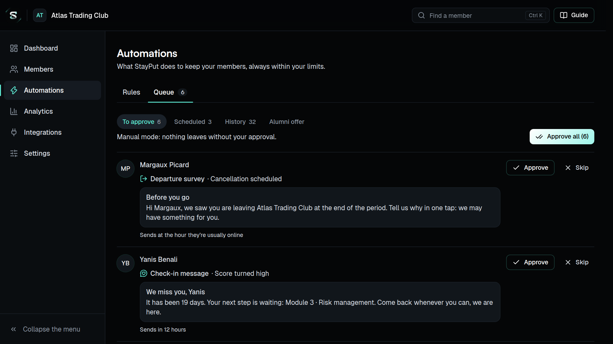
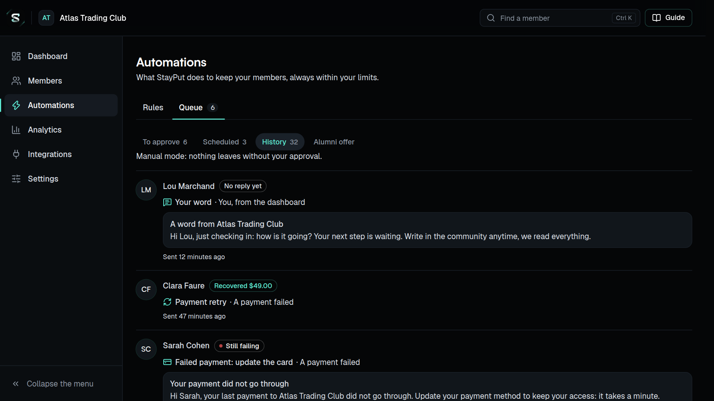
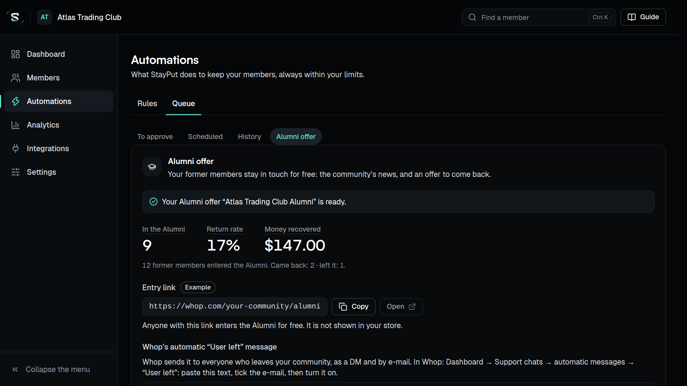

# Fiche App Store (Whop)

Ce qu'il faut remplir pour publier StayPut sur l'App Store de Whop, dans l'app **de production**
(whop.com → Dashboard → Developer → StayPut). Les textes de la fiche sont en anglais (SPEC 9.3),
avec les mots-clés **churn, retention, member risk, failed payments, win-back** ; ils ne promettent
que ce que StayPut fait aujourd'hui.

Les mêmes champs existent dans l'API de Whop (`PATCH /apps/{id}`) : `name`, `description` (la
courte, dans les listes et la recherche), `app_store_description` (la longue, sur la page de
l'app) et `icon`. Passer l'app en `live` (visible dans l'App Store) demande un nom, une icône et
une description ; d'ici là elle reste `hidden`.

## Nom

```
StayPut
```

## Sous-titre

```
Predict churn. Recover failed payments. Win members back.
```

## Description courte (`description`)

```
Churn prevention for Whop communities: member risk scores, failed payment recovery and win-back offers, with every dollar saved counted.
```

## Description longue (`app_store_description`)

```
StayPut keeps your members from leaving, and shows you the money it saved.

StayPut follows your Whop community (memberships, payments, chats, forums, courses, and your Discord and Telegram if you connect them) and every hour gives each member a churn risk score from 0 to 100, with the reasons behind it: a failed payment, a cancellation scheduled, a member gone quiet. You see who is about to leave before they do.

Then it acts, within the limits you set:
• Failed payments: a Whop notification asking the member to update their card, and a retry of the payment.
• Members at risk: a short check-in message, sent at the hour they are usually online.
• Members who cancel: a one-tap departure survey, with the offer that answers their reason (a discount, a pause, free days, your help). Their membership is only kept with their consent.
• Former members: a free Alumni offer keeps them in touch, with a unique comeback code 7, 30 and 60 days after they left.

Automatic or manual: let StayPut send on its own, or approve each message from a queue, one click at a time or all at once. Quiet hours, frequency limits, a do-not-contact list and a global stop apply to every message. A new community starts in manual mode: nothing is sent until you approve it. Test mode, one switch away, computes everything and sends nothing. And when you want to say it yourself, write to any member in your own words: it goes out as a Whop notification with your picture.

Every save is counted with its proof (the payment recovered, the cancellation withdrawn, the member who came back), so your dashboard shows revenue saved, not guesses. Every Monday, a Whop notification sums up your week.

Built for privacy: StayPut never reads your members' e-mail addresses or phone numbers, keeps detailed activity for 12 months, and deletes your community's data 30 days after you uninstall it. In English and French.
```

## Fonctionnalités

À reprendre en liste là où Whop en demande une :

- **Member risk score** — 0 to 100 for every member, every hour, with its reasons.
- **Revenue saved dashboard** — money saved this month, revenue at risk, members at risk, and the one action to take today.
- **Failed payment recovery** — card update notices and payment retries through Whop.
- **Departure survey and offers** — the right offer for each reason to leave: discount, pause, free days, the creator's help.
- **Win-back with the Alumni offer** — a free space for former members, comeback codes at 7, 30 and 60 days.
- **Automatic or manual mode** — act on its own, or approve every message from a queue.
- **Guardrails** — quiet hours, frequency limits, do-not-contact list, global stop, test mode.
- **Attribution with proof** — every save tied to the action that made it.
- **Discord and Telegram** — their activity counts in the score.
- **Analytics** — why members leave, cohorts, lessons, and a Monday report.
- **Verified retention badge and anonymous benchmarks** — both optional.
- **Privacy first** — no e-mail or phone read, a member's data exported or deleted on request,
  a data processing agreement.

## Captures d'écran

Cinq captures de la démo (une communauté imaginaire, « Atlas Trading Club », dont les données sont
inventées dans le navigateur), en **1920 × 1080**, dans `docs/app-store/`. Elles sont refaites à
chaque Inspect par `scripts/ops/store.mjs` sur le site déployé (avec les polices de StayPut), sans
le bandeau de la démo ; les dernières sont aussi sur la branche `screenshots`, dossier `store/`.

| Fichier                 | Légende (anglais)                                             |
| ----------------------- | ------------------------------------------------------------- |
| `1-dashboard.png`       | Revenue saved, revenue at risk, and the one thing to do today |
| `2-members.png`         | Every member’s churn risk, the most likely to leave first     |
| `3-queue.png`           | Approve each message, or let StayPut act within your limits   |
| `4-failed-payments.png` | Failed payments retried and recovered, each one counted       |
| `5-win-back.png`        | Win back former members with the free Alumni offer            |

Si Whop demande un autre format, il suffit de changer la fenêtre (1280 × 720) et le facteur
d'échelle (1,5) en tête de `scripts/ops/store.mjs`.







## Icône

`docs/brand-logo-1024.png` (1024 × 1024, PNG) : le S de StayPut sur fond noir.

## Liens

- Pas de page légale : Whop n'en demande aucune, aucune app de l'App Store n'en montre, et elles
  sont éteintes (`LEGAL_PAGES_ENABLED`, décision du 10/10/2026). Rallumées, elles seraient à
  `/privacy`, `/terms` et `/dpa`.

Les trois pages attendent encore l'identité de l'éditeur (raison sociale, adresse, e-mail, droit
applicable) et une relecture : voir `docs/production.md`, étape 5.

## Prix

À remplir après la phase 7 (les formules et ce que chacune donne).
